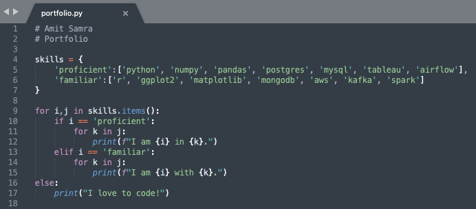

# Projects

### 1. [Analysis of Personal Amazon.com Order History](https://github.com/AmitSamra/DataEngineering.Labs.AirflowProject)

Tools Utilized: Python, Pandas, PostgreSQL, SQLAlchemy, Airflow, AWS

Obtained personal Amazon.com order history stored on AWS, wrangled data using Pandas, loaded data into SQL database and utilized matplotlib in Jupyter to perform data visualizations. 

[Home](https://github.com/AmitSamra#)

### 2. [Exploring NYC Crime Statistics](https://github.com/AmitSamra/Week9-ResearchProjects)

Tools Utilized: R, ggplot, MongoDB

Learned and applied R language to wrangle data and perform visualizations using ggplot; loaded transformed data into MongoDB NoSQL database. 

[Home](https://github.com/AmitSamra#)

### 3. [Determining Tesla Stock Price](https://github.com/rich1123/Sentiment.Analysis)

Tools Utilized: Python, Pandas, NLTK, Spark, Airflow

As a group, used yfinance and NLTK Python modules, Twitter API and NewsAPI to correlate number of tweets referencing ‘Tesla’ and NLP of news headlines with change in Tesla’s stock price; utilized Airflow, Spark, pandas and matplotlib. Personally responsible for data acquisition from APIs, NLP and regression model. 

[Home](https://github.com/AmitSamra#)