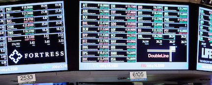

# Projects

### 1. [Determining Tesla Stock Price](https://github.com/rich1123/Sentiment.Analysis)

Tools Utilized: Python, Pandas, NLTK, Spark, Airflow

As a group, used yfinance and NLTK Python modules, Twitter API and NewsAPI to correlate number of tweets referencing ‘Tesla’ and NLP of news headlines with change in Tesla’s stock price; utilized Airflow, Spark, Pandas and Matplotlib; Personally responsible for data acquisition from APIs, NLP and regression model in Pandas. 

[Home](https://github.com/AmitSamra#)

### 2. [Analysis of Personal Amazon.com Order History](https://github.com/AmitSamra/AmazonOrderHistoryAirflowAWS)

Tools Utilized: Python, Pandas, Matplotlib, PostgreSQL, SQLAlchemy, AWS, Airflow

Obtained personal Amazon.com order history stored on AWS S3; wrangled data using Pandas; loaded clean data into PostgreSQL database on AWS RDS and utilized matplotlib in Jupyter to create data visualizations; ETL pipeline was automated using Airflow; moved project onto an EC2 instance to run entirely on the cloud.

[Home](https://github.com/AmitSamra#)

### 3. [Exploring NYC Crime Statistics](https://github.com/AmitSamra/NYC_Crime)

Tools Utilized: R, ggplot2, Python, Pandas, MySQL, SQLAlchemy, Socrata, MongoDB, Tableau

Acquired data from Socrata API and performed ETL in Python; persisted clean data into MySQL; used R to create visualizations using ggplot2; loaded transformed data into MongoDB NoSQL database; utilized Tableau to generate additional visualizations. 

[Home](https://github.com/AmitSamra#)

### 4. [A 10,000 Foot Overview of Financial Markets](https://github.com/AmitSamra/Bonds)

Tools Utilized: Quandl, Python, Pandas, Matplotlib

Accessed financial data using the Quandl API; performed ETL using Python/Pandas; created visualizations using Matplotlib.

[Home](https://github.com/AmitSamra#)